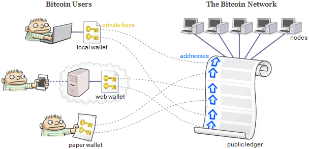

# Design for Blockchain Economic System

"Blockchain" is believed to be the next disruptive technology, which involves a lot of technical problems and engieering work. The blockchain community has been working hard to build the software infrastructure of public blockchains like ethereum and improve their scaling capabilities to process more transactions per second. 

## 1. What Blockchain brings to us?

At first glance, it seems to be a software development task which is an absolutely "engineering" work, but it is not. What blockchain brings to us is actually a new **"Blockchain Economic System"**, which is the "digital twin" of our physical economic system in the crypto world:

* each person in *physical world* is "mapped" or "digitalized" into the *crypto world* as a "digital twin" with wallet.  
* each person can be uniquely represented with his/her own wallet, because only the ower has the private key to access the fund in the wallet.
* users interact with each other and the economic system through transactions with their wallets.

The concept is illustrated with following figure:

|  | 
|:--:| 
| *Users are mapped into Crypto Space with Wallet (source: What is Bitcoin, Really?[1])* |

At this time, the crypto world is inundated with scattered blockchain applications like isolated islands in the ocean. In particular, most of these applications are built on top of Ethereum network to create customized token (i.e., ERC20 tokens) and implement complex logics using smart contract. 

As such, each blockchain application builds an "blockchain economic system" in specific application domain, which has its own token as incentives and operating rules (e.g., defined with smart contract and deployed on Ethereum network). 

## 2. Why design of economic system is critical?

The development of blockchain application is not techinically difficult on Ethereuem network thanks to complete community support (e.g., Truffle framework and etc.). However, the "design" of the economic system such as "rules" is extremely difficult and challenging.

### 2.1 Code Is Law

The rules of blockchain economic system are defined with smart contracts. Due to the principles of blockchain immutability, the "deployed" contracts are immutable as carved in stone and all smart contract executions are final. As such, people believe "Code is Law" on the blockchain and build their "Trust" with the blockchain economic system. 

However, the blockchain immutability is a two-edged sword bringing significant obstacle to the design of economic system, because there is no way to repair bugs or upgrade with features on the deployed contracts. Therefore, it is urgently sought to have a “indefectible” design of rules with one-shot opportunity at the very beginning.
 

### 2.2 Reconcile Conflict Interests 

In any economic system, participants usually are egoistic who make decisions in their own best interest. In the meantime, all participants form an economic system which needs to survive and evolve for social interest of the whole community. 

The pursuits of self-interest and social interest seems to be conflict, but they can be reconciled by a “well-designed” economic system with rules and incentives. In this kind of system, individuals acting in their own self-interest can “unconsciously” promote the evolvement of the entire community and benefit the social interest. 

Our human society is a case in point: individuals work hard to achieve their own self interest such as fame and fortune. In the same process, they create tremendous value to the society and contribute to the social interest. This is what Adam Smith called the "invisible hand". Our human society has been operating in this way for thousands years and it works pretty well. 

Therefore, the design of rules in blockchain economic system shall reconcile the conflict between self interest and social interest to benefit the community as a whole.

## What kind of rules and incentives?

The rules of economic system defines how people can participate in the system and interact with each other. It has mechanism to prevent bad actors from cheating or damaging the system. Bad actors shall receive punishment for their malicious behavior. People receive attractive incentives so that they have motivations to contribute. If every participant behaves very well, the operation of community can have positive feedback loop and it becomes a self-sustainable and autonomous system.

## What makes the system fail?

1. Inadequate Incentive: people usually tend to be lazy, so they will not volunteer to make contribution (e.g., mining blocks, maintain registry, challenge fake result or verify computing results, etc.). Therefore, without attractive incentives and participants’ contribution, the system have no way to survive.

2. Bad Actors: when the system has loophole, bad actors can cheat the system and cause damages to other honest actors without punishment. If the bug of system cannot be fixed, honest actors will leave and bad actors stay. Eventually bad actors will leave the system as well and the system dies.

## How to design economic system?

It is very interesting to characterizes the blockchain network as a robotic network. But I notice an important discrepancy: the behavior of agent in robotic network follows the physical rules and quite predictable, so the state change of agent is limited. However, behavior of people in blockchain network is extremely unpredictable because people has the capability of creation and imagination. They have unlimited changes of their state in the economic system, which demands a “indefectible” design of the blockchain system to prevent potential malicious behavior.

From this point of view, the blockchain system is much more complicated than physical system and needs more cross-discipline knowledge such as engineering, gaming theory, sociology, psychology, finance and etc. I believe people will build a close-to- indefectible procedure or framework to design the blockchain economic system over the time. 

# Reference
* [1] [What is a Bitcoin, Really?](http://preshing.com/20140127/what-is-a-bitcoin-really/)